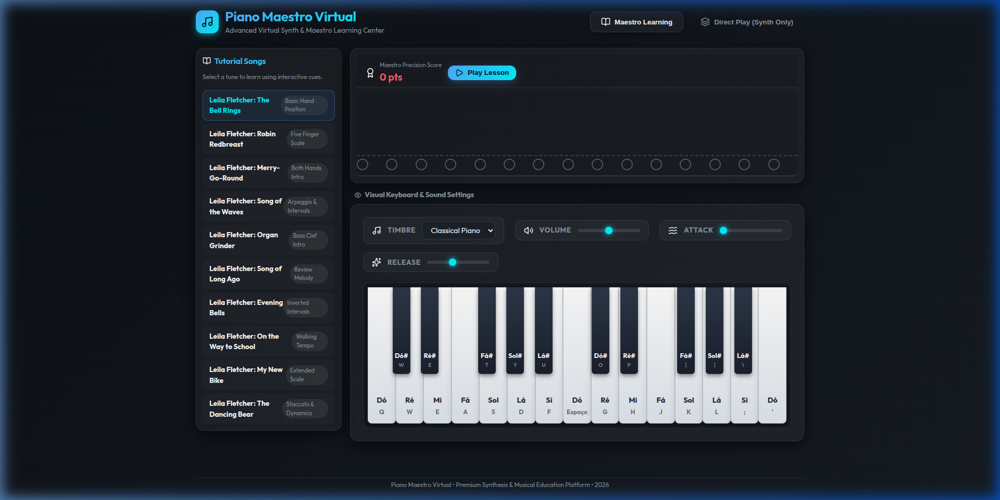
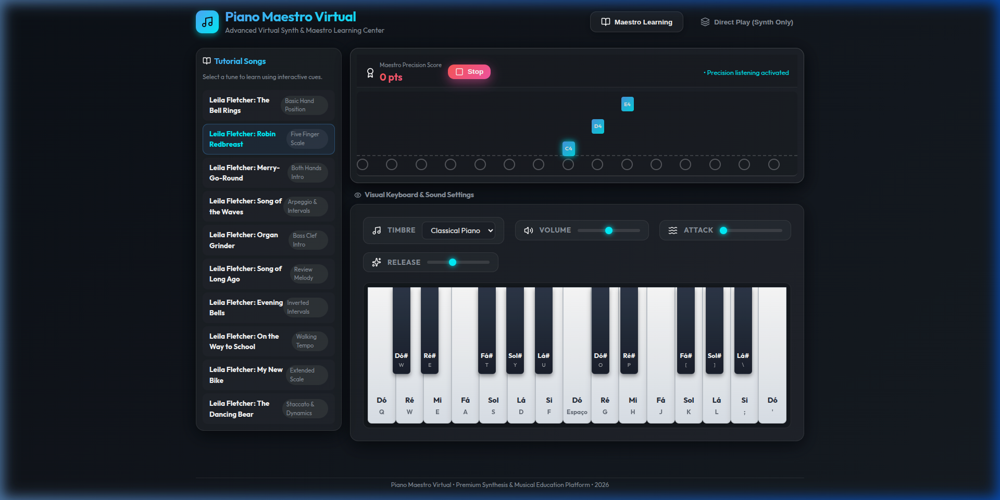

# 🎹 Piano Maestro Virtual

[**✨ Explore the Live Demo**](https://zsubzeroz.github.io/Piano-Maestro-Virtual/)



A high-performance, immersive single-page application that blends a professional **Virtual Synthesizer** with an interactive **Maestro Learning System**. Designed with a premium glassmorphism aesthetic, it offers a zero-latency musical experience directly in your browser.

---

## 🌟 Key Features

### 🎹 Advanced Virtual Synth
Experience rich, multi-layered sounds with our custom Web Audio API engine.
- **Multiple Timbres**: Switch between Classical Piano, Digital Synth, Electric Organ, and Music Box.
- **Envelope Control**: Fine-tune your sound with adjustable **Attack** and **Release** parameters.
- **Full Keyboard Mapping**: Play naturally using your PC keyboard with intuitive mappings for both white and black keys.

### 🎓 Maestro Learning Mode
Master classical melodies with our Synthesia-inspired visualizer.
- **Falling Note Cues**: Visual indicators guide you through complex pieces.
- **Interactive Scoring**: Receive real-time feedback on your precision and timing.
- **Curated Songbook**: Includes professional exercises from the *Leila Fletcher Piano Course*.



---

## ⌨️ PC Keyboard Controls

Unleash your creativity with your computer keyboard:

| Key Type | Keys |
| :--- | :--- |
| **White Keys** | `Q` `W` `E` `A` `S` `D` `F` `Space` `G` `H` `J` `K` `L` `;` `'` |
| **Black Keys** | `W` `E` `T` `Y` `U` `O` `P` `[` `]` `\` |

---

## 🚀 Getting Started

### Prerequisites
- Node.js (v18 or higher)
- npm or yarn

### Installation
1. Clone the repository
   ```bash
   git clone https://github.com/Zsubzeroz/Piano-Maestro-Virtual.git
   ```
2. Install dependencies
   ```bash
   npm install
   ```
3. Run in development mode
   ```bash
   npm run dev
   ```

### Production Build
To create an optimized production bundle:
```bash
npm run build
```

---

## 🛠️ Built With
- **React 19** - UI Framework
- **Vite 8** - Lightning-fast build tool
- **Web Audio API** - High-fidelity sound synthesis
- **Lucide React** - Premium iconography
- **CSS Modules** - Advanced glassmorphism styling

---

## 📄 License
This project is licensed under the MIT License.

---

<div align="center">
  Made with ❤️ for Musicians & Developers
</div>
